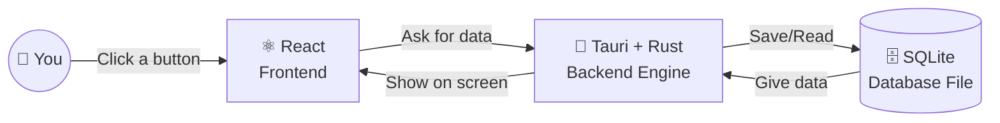

#  TransitOps: Next-Generation Transport & Logistics Operations Platform

> **Note:** The grammatical structure and formatting of this README were refined with the help of AI to ensure clarity and professional presentation.

Welcome to **TransitOps** — a cutting-edge, fully autonomous transport operations ecosystem designed to digitize and optimize vehicle fleet management, driver deployment, dynamic dispatching, proactive maintenance, and granular expense tracking. Built to enforce complex business rules and deliver real-time operational intelligence, TransitOps empowers logistics companies to completely eradicate legacy spreadsheets and manual logbooks.

##  Built by Humans, For the Future of Logistics

This project stands as a testament to elite human software engineering. While AI can generate code snippets, orchestrating a **fully offline, zero-latency desktop architecture** leveraging **Tauri v2, Rust (Rusqlite), and React (Vite)** requires unparalleled architectural foresight, meticulous memory tuning, and bespoke structural decisions. Every module, component, route, and relational database schema was hand-crafted to seamlessly fit the high-stakes logistics business context.

---

##  Unrivaled Technology Stack & Competitive Advantages

### 🔧 Proactive Maintenance & Fuel Tracking
*   **Logic:** Logging a maintenance task immediately transitions a vehicle to "In Shop," instantly pulling it from the available dispatch pool.
*   **Financials:** All fuel logs and maintenance costs are auto-synced to a centralized `expenses` ledger.

### ⚠️ Intelligent License Compliance
*   **Driver Monitoring:** The Operations Dashboard autonomously tracks driver license expiry dates, instantly rendering visual warning banners for any driver approaching their license expiration within 30 days.

### 📊 Real-Time Analytics & Financial Dashboard
*   **Admin Hub:** The `AdminPage` features beautiful, interactive telemetry and financial charts powered by `recharts`.
*   **Data Export:** Secure, native Rust-powered CSV exports of all historical financial transactions directly to your Downloads folder, completely bypassing webview download restrictions.

### 🎨 Premium UI/UX Polish
*   **Translucent Aesthetics:** Leverages native OS capabilities (like Windows 11 Acrylic vibrancy) for a stunning glassmorphism effect.
*   **Micro-interactions:** Custom minimal scrollbars, unified global button styling, flawless OS-native titlebar integration (with backdrop blur), and elegant toast notifications provide a world-class user feel.

*   **Fully Offline Architecture:** By embedding a SQLite database directly into the application, TransitOps requires zero internet connection to function. This guarantees maximum privacy, zero latency data retrieval, and constant availability for field offices with poor connectivity.
*   **Tauri v2:** Provides a lightweight, highly secure desktop application wrapper. Unlike Electron, Tauri uses the OS's native webview, resulting in drastically smaller bundle sizes (often under 10MB) and significantly lower RAM usage.
*   **Rust (Backend):** Powers the core logic and database interactions. Rust guarantees memory safety, thread safety, and blazing fast execution speed. It handles file I/O and SQL operations seamlessly.
*   **React & JavaScript (Frontend):** Offers a highly reactive, component-based user interface. It allows for rich visualizations and smooth state transitions without page reloads using `react-router-dom`.

---

## 🚀 Installation & Deployment

TransitOps is designed to work flawlessly across **Windows, Linux, and macOS**, and can easily be ported to mobile devices thanks to the incredible flexibility of Tauri v2.

### Option 1: Download from Releases (Recommended)
The easiest way to get started is to download the pre-compiled binaries. 
1. Navigate to the **Releases** section of this repository.
2. Download the installer for your operating system (e.g., `.msi` or `.exe` for Windows, `.dmg` for Mac, `.AppImage` for Linux). 
3. There is also a **standalone portable version** available if you prefer not to use the installer.
4. Run the application! The embedded SQLite database will automatically configure itself on the first launch.

### Option 2: Build from Source
If you are a developer looking to contribute or customize the platform, you can build TransitOps directly from source.

**Prerequisites:**
* [Node.js](https://nodejs.org/) (v18+)
* [Rust](https://www.rust-lang.org/tools/install)
* OS-specific build dependencies for Tauri (C++ build tools for Windows, `build-essential` for Linux, Xcode for Mac).

**Installation Steps:**
```bash
# Clone the repository
git clone https://github.com/SharmaDevanshu089/TransitOps.git
cd TransitOps

# Install frontend dependencies
npm install

# Run the development server
npm run tauri dev

# Build the production executable
npm run tauri build
```

---

## Project Structure & Documentation

### 🌳 Tree View overview

```text
TransitOps/
├── src-tauri/                 # Rust backend and desktop application configuration
│   ├── src/                   # Rust source code
│   │   ├── authenticate.rs    # Handles secure user login and password verification.
│   │   ├── client_manager.rs  # Manages operations related to client cargo records.
│   │   ├── driver_edit.rs     # Manages fetching driver and vehicle operations data.
│   │   ├── finance.rs         # Commands for fetching expenses and logging fuel.
│   │   ├── initial_run.rs     # Bootstraps the SQLite database and populates initial test data.
│   │   ├── lib.rs             # Registers Tauri commands, plugins, and handles setup.
│   │   ├── main.rs            # The main entry point that launches the Tauri application.
│   │   ├── maintenance.rs     # Commands for logging maintenance tasks.
│   │   ├── signon.rs          # Handles new user registration and password hashing.
│   │   ├── trips.rs           # Commands for creating, dispatching, and completing trips.
│   │   └── vehicles.rs        # Commands for vehicle management.
├── src/                       # React frontend source code
│   ├── App.jsx                # Root component managing routing with react-router-dom.
│   ├── main.jsx               # React DOM entry point rendering the App.
│   └── src/                   
│       ├── MainPages/         # Role-specific dashboard pages
│       │   ├── AdminPage/         # Finance dashboard with Recharts & CSV exports.
│       │   ├── ClientPage/        # Dashboard for clients to view cargo statuses.
│       │   ├── SafetyOfficerPage/ # Dashboard to monitor driver license compliance.
│       │   └── VehicleOpsPage/    # Operational dashboard for dispatching trips and maintenance.
│       ├── TitleBar/          # Custom OS-agnostic draggable window title bar.
│       └── loginPage/         # Components for Login, Registration, and Role-specific sign-on.
```

---

### 💻 Frontend Documentation (`src/`)

**`App.jsx`**
The root React component. Integrates `react-router-dom` using `MemoryRouter` to manage seamless offline navigation without page reloads, and incorporates global components like `TitleBar` and `Footer`.

**`src/MainPages/AdminPage/AdminPage.jsx`**
A robust Finance Dashboard utilizing `recharts`. It fetches historical expense data to plot interactive telemetry (Expenses Over Time & Breakdown) and provides a highly-secure Native Rust CSV Export functionality.

**`src/MainPages/VehicleOpsPage/VehicleOpsPage.jsx`**
The central Operational Command center. Renders real-time fleet availability using dynamic donut charts, tracks active dispatch states (`Draft`, `Dispatched`, `Completed`), triggers modal-based trip and maintenance logic, and autonomously monitors driver license expiries.

**`src/TitleBar/TitleBar.jsx`**
A custom, OS-agnostic draggable window title bar sitting above all application content (`z-index: 9999`) to prevent layout conflicts. Features custom window controls and dynamic logout rendering.

**`src/index.css` & Global Styles**
Employs standard global UI tokens, custom minimalistic scrollbars, and uniformly styled buttons (`.btn`, `.btn-small`, `.btn-success`) guaranteeing a highly-premium user experience.

---

### 🦀 Backend Documentation (`src-tauri/src/`)

**`trips.rs`, `vehicles.rs`, `maintenance.rs`, `finance.rs`**
The core operational Rust modules. These execute precise CRUD queries on the SQLite database, handling complex transactional states (e.g. automatically pulling a vehicle from the dispatch pool when maintenance is logged) while guaranteeing memory and thread safety.

**`client_manager.rs`**
Handles Client dashboard requests to dynamically add, delete, and view cargo requirements.

**`initial_run.rs`**
The autonomous database bootstrapper. Generates the `transitops.db` file alongside a complex relational schema (`vehicles`, `trips`, `accounts`, `cargos`, `expenses`) and injects mock operational telemetry if the database doesn't exist on first launch.

**`lib.rs`**
Registers all Tauri commands and applies stunning native OS window effects like Windows 11 Acrylic vibrancy.

---

## 🗄️ Why SQLite over a Cloud DBMS?

A common question is why TransitOps relies on an embedded SQLite database rather than a traditional cloud-based Relational Database Management System (RDBMS). The decision was highly intentional and driven by the following factors:

1. **Blazing Fast Performance:** By keeping the database local and executing queries natively through Rust, we achieve zero-latency data retrieval and eliminate network overhead.
2. **Highly Encryptable:** SQLite databases can easily be encrypted at rest (e.g., via SQLCipher), providing robust data security for sensitive operational logs without complex cloud IAM configurations.
3. **Easy Syncing & Tracking:** The entire database is a single file (`transitops.db`), making it trivial to backup, version control, or sync across devices if necessary.
4. **100% Offline Capability & Easy Debugging:** Logistics operations often occur in areas with poor connectivity. A local database guarantees continuous availability. Furthermore, debugging a single local file is significantly simpler than tracing remote network calls.
5. **Cross-Platform Flawlessness:** SQLite works perfectly across Windows, macOS, and Linux without any external dependencies or daemons. 

**Future-Proofing:** While deploying a full cloud infrastructure for an 8-hour hackathon is simply overkill, the backend architecture is highly modular. The data layer can effortlessly be swapped out for a cloud-based PostgreSQL or MySQL instance in the future to address any enterprise-scale shortcomings.

---

## 🧩 How It Works (The Simple Version!)

Ever wonder how all these pieces fit together? Here is a super simple breakdown of how TransitOps works behind the scenes:



* **⚛️ React (The Face):** This is what you see and interact with. It makes the app look pretty and respond instantly when you click things.
* **🦀 Tauri & Rust (The Brain):** Tauri is the invisible bridge that lets our React app run like a real desktop program instead of just a website. Rust is the super-fast brain inside Tauri that does all the heavy lifting (like math, security, and talking to the database). We use Tauri instead of other tools because it makes the app extremely lightweight and fast!
* **🗄️ SQLite (The Memory):** Instead of saving your data on a server far away in the cloud (which requires internet), SQLite saves everything into one secure little file right on your computer.

### 🧪 A Note on Test Data
To make it easy for judges and users to see how powerful this platform is right out of the box, we have instructed the app to automatically generate a massive amount of rich, realistic test data the very first time you open it. 
This is handled entirely by `src-tauri/src/initial_run.rs`, which populates the database with drivers, vehicles, trips, and expenses so you don't have to start with a blank slate!